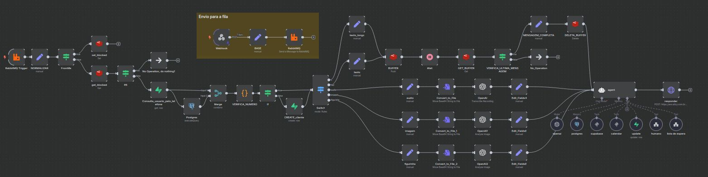

#  Assistente Virtual WhatsApp

##  Contexto

Desenvolvimento de uma assistente virtual para WhatsApp capaz de:

- Atender clientes automaticamente  
- Processar diferentes tipos de mídia  
- Manter contexto de conversa  
- Integrar com sistemas externos  
- Escalar desde MVP até produção  

---

##  Solução

Workflow estruturado no **n8n** para operar como uma assistente virtual inteligente, utilizando IA, memória conversacional e integrações via API.

A solução foi desenhada para lidar com mensagens de texto, áudio, imagem e figurinha.

---

## Funcionalidades

Recebimento de mensagens via Webhook  
Identificação do tipo de mensagem (texto / áudio / imagem / sticker)  
Processamento multimodal com OpenAI  
Transcrição automática de áudios  
Análise de imagens  
Memória conversacional (PostgreSQL)  
Consulta e persistência de dados (Supabase)  
Controle de estado e bloqueio (Redis)  
Bufferização de mensagens  
Transferência para atendimento humano  

---

## Inteligência Implementada

- Classificação dinâmica de mensagens  
- Processamento contextual via modelo de linguagem  
- Interpretação de mídia (áudio / imagem / figurinha)  
- Gestão de contexto de conversa  
- Regras de fallback  
- Transferência inteligente para humanos  

---

## Integrações

- WhatsApp (Webhook / API)  
- OpenAI (texto, áudio e imagem)  
- PostgreSQL (memória de contexto)  
- Supabase (dados estruturados)  
- Redis (buffer / bloqueio / controle de estado)  

---

## Arquitetura do Workflow

Webhook  
→ Normalização dos dados  
→ Identificação do tipo de mensagem (Switch)  
→ Processamento específico por mídia  
→ IA / Modelo de linguagem  
→ Memória conversacional  
→ Regras de negócio  
→ Resposta automatizada  
→ Logs / Controle de estado  

---

## Stack

- n8n  
- OpenAI  
- Redis  
- PostgreSQL  
- Supabase  
- APIs HTTP  

---

## Workflow

---

## Impacto

Atendimento automatizado 24/7  
Processamento multimodal  
Memória de contexto  
Arquitetura escalável  
Redução de carga operacional  
Base para evolução de agente conversacional  

---

## 👤 Autor

**Lucas Hideki**  
Product Owner | Automação | n8n | Processos  

📧 lucashidekitb@gmail.com  
🔗 https://www.linkedin.com/in/lucas-hideki-tb
