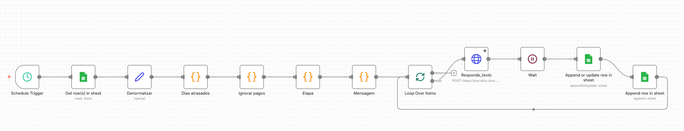

# Cobrança Inteligente de Boletos

## Contexto

Processo de cobrança realizado manualmente, sujeito a falhas como:

- Mensagens duplicadas  
- Falta de timing estratégico  
- Risco de erro operacional  
- Ausência de histórico estruturado  

Além do alto esforço manual envolvido.

---

## Solução

Workflow desenvolvido no **n8n** para automatizar e padronizar o processo de cobrança com base em regras de negócio.

A automação analisa vencimentos, calcula atraso, define a etapa de cobrança e executa o envio de mensagens de forma controlada.

---

## Funcionalidades

Leitura automática de dados via Google Sheets  
Cálculo dinâmico de dias em atraso  
Filtro de registros com status "Pago"  
Classificação da etapa de cobrança (Pré, D+1, D+5)  
Geração de mensagens personalizadas  
Envio automatizado via API  
Atualização de status  
 Registro de logs  

---

## Regras Implementadas

- Ignora clientes com pagamento identificado  
- Evita disparos duplicados  
- Respeita timing estratégico de cobrança  
- Mantém rastreabilidade das interações  

---

## Arquitetura do Workflow

Schedule Trigger  
→ Leitura da planilha  
→ Cálculo de atraso  
→ Filtro de pagamentos  
→ Definição da etapa  
→ Geração de mensagem  
→ Envio via API  
→ Atualização / Logs  

---

## Stack

- n8n  
- Google Sheets  
- JavaScript  
- APIs HTTP  

---

## 📸 Workflow

---

## Impacto

Redução de esforço manual  
Minimização de erros operacionais  
Comunicação padronizada  
Processo escalável  
Histórico confiável  

---

## 👤 Autor

**Lucas Hideki**  
Product Owner | Processos | Automação | n8n  

📧 lucashidekitb@gmail.com  
🔗 https://www.linkedin.com/in/lucas-hideki-tb

