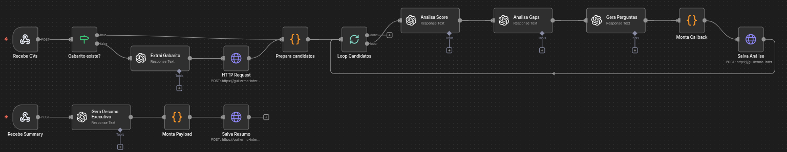
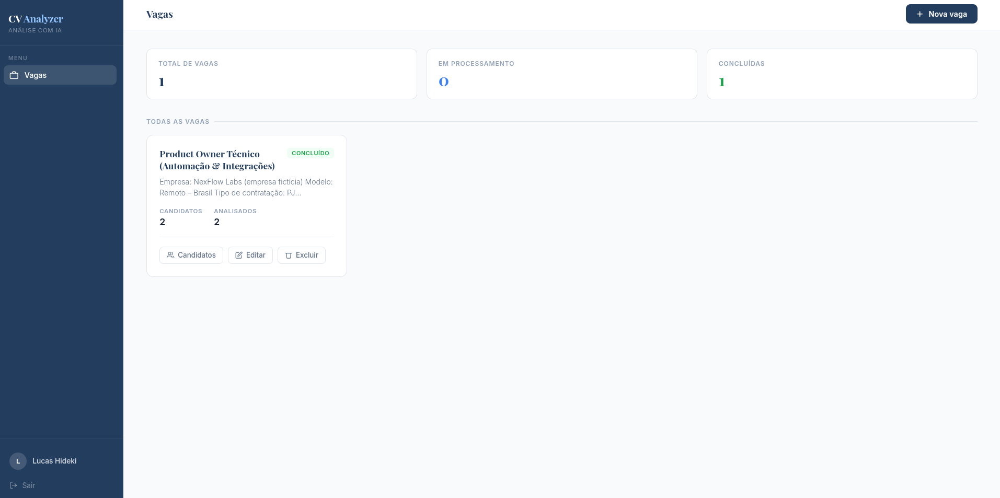
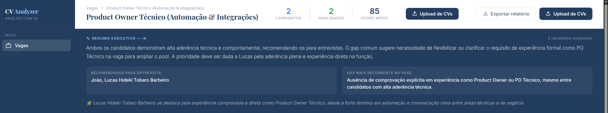
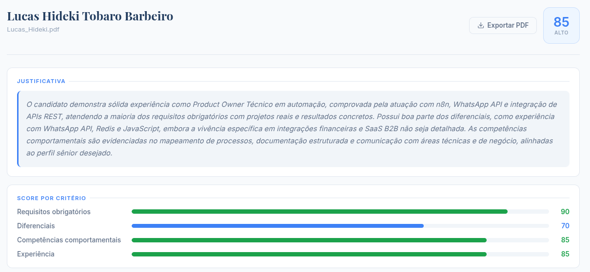
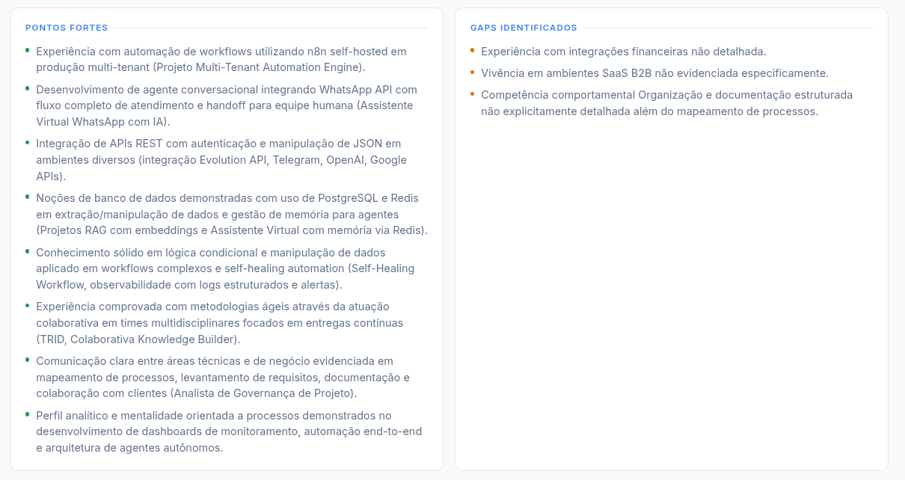
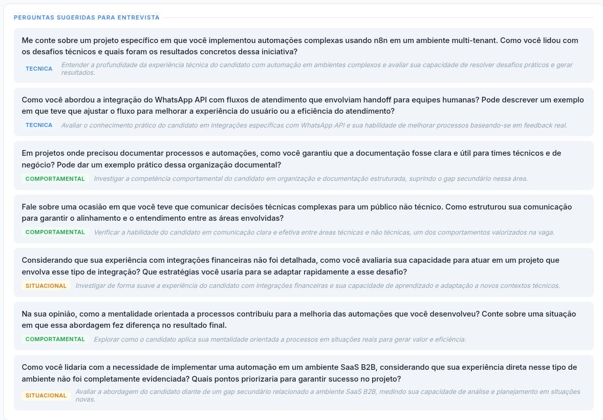

# CV Analyzer

Analisador de currículos com IA para times de RH. O RH cria a vaga, faz upload dos PDFs e recebe score, gaps e perguntas de entrevista gerados por prompts encadeados no n8n. O Flask entrega o produto.

---

## Propósito

Um sistema onde o RH descreve a vaga e faz upload dos currículos em PDF. A IA extrai os critérios de avaliação, define os pesos por critério e analisa cada candidato de forma objetiva com justificativa baseada em evidências concretas do currículo, não em palavras-chave.

O resultado aparece em tempo real em um painel dividido: ranking à esquerda, análise completa à direita. Sem trocar de página.

Adicionar uma nova vaga é preencher um formulário. Adicionar candidatos é fazer upload dos PDFs.

---

## O que o sistema entrega

- **Score 0-100**: com justificativa objetiva e âncoras de calibração, um candidato mediano recebe um score mediano
- **Score por critério**: requisitos obrigatórios, diferenciais, competências comportamentais e experiência separados em barras visuais
- **Gaps críticos vs secundários**: requisitos obrigatórios ausentes separados de diferenciais ausentes, com evidências concretas do currículo
- **Perguntas de entrevista personalizadas**: geradas para aquele candidato específico, baseadas nos gaps e pontos fortes identificados
- **Resumo executivo do pool**: gerado automaticamente quando o último candidato é processado, com recomendação de quem chamar para entrevista
- **Exportação em PDF**: relatório individual por candidato ou relatório completo da vaga

---

## Triggers

**Upload de currículos**: o RH seleciona os PDFs no painel. O Flask extrai o texto com pdfplumber, cria os candidatos no banco e aciona o webhook do n8n com job + candidatos.

**Processamento em batch**: o n8n processa cada currículo sequencialmente através de 4 prompts. Ao final de cada análise, faz callback para o Flask salvando os resultados.

**Resumo executivo**: quando o último candidato é processado e `pending = 0`, o Flask aciona automaticamente o workflow de resumo passando todos os resultados do pool.

---

## Decisão Técnica

O gabarito é extraído uma única vez por vaga. Na primeira vez que o n8n recebe candidatos sem gabarito, roda o Prompt 0, que lê a descrição da vaga e retorna um JSON estruturado com requisitos, diferenciais, competências e pesos:

```json
{
  "requisitos_obrigatorios": ["..."],
  "requisitos_diferenciais": ["..."],
  "competencias_comportamentais": ["..."],
  "nivel_senioridade": "pleno",
  "pesos": {
    "requisitos_obrigatorios": 0.5,
    "requisitos_diferenciais": 0.2,
    "competencias_comportamentais": 0.2,
    "experiencia": 0.1
  }
}
```

Os pesos somam 1.0 e são definidos pela própria IA com base na descrição da vaga. Uma vaga técnica sênior pondera diferente de uma vaga comercial júnior.

Os 3 prompts de análise rodam em sequência com contexto acumulado:

```
Prompt 1 → Score + justificativa + score por critério
Prompt 2 → Pontos fortes + gaps (usa score do Prompt 1 como contexto)
Prompt 3 → Perguntas de entrevista (usa gaps do Prompt 2 como contexto)
```

A qualidade do Prompt 3 depende do Prompt 2. A qualidade do Prompt 2 depende do Prompt 1. O contexto acumulado é o que diferencia respostas genéricas de análises precisas.

O controle de idempotência do gabarito evita reprocessamento:

```python
if pending == 0:
    cur.execute("UPDATE jobs SET status = 'done' WHERE id = %s", (job_id,))
    # dispara workflow de resumo executivo
```

O resumo executivo só roda uma vez quando o batch completo foi processado.

---

## Prompt Engineering

O projeto foi construído como estudo de prompts encadeados em produção. As decisões principais:

**Calibração de score**: O Prompt 1 usa âncoras explícitas para evitar inflação:

```
90-100: Atende TODOS os requisitos obrigatórios com experiência comprovada
70-89: Atende a maioria dos obrigatórios com pequenas lacunas
50-69: Atende parcialmente os obrigatórios
30-49: Gaps críticos nos obrigatórios
0-29: Não atende os requisitos mínimos
```

**Evidências concretas**: O Prompt 2 é instruído a citar o que está no currículo, não generalidades. "Experiência com n8n em produção self-hosted" é melhor que "Experiência com automação".

**Perguntas não confrontacionais**: O Prompt 3 investiga gaps com "Qual sua experiência com X?" em vez de "Você sabe X?", e aprofunda pontos fortes pedindo exemplos concretos e resultados mensuráveis.

---

## Separação de Responsabilidades

O n8n brilha em orquestração encadear prompts, acumular contexto, reagir a eventos. CRUD, sessão e lógica de produto são mais limpos em código.

**n8n cuida de:**
- Verificação de gabarito e execução do Prompt 0
- Processamento sequencial dos 4 prompts por candidato
- Chamadas à OpenAI API
- Parse e validação dos JSONs retornados
- Callbacks para o Flask com os resultados
- Workflow separado para o resumo executivo do pool

**Flask cuida de:**
- API REST completa
- Painel do RH (vagas, candidatos, análise inline)
- Upload e extração de texto dos PDFs (pdfplumber)
- Disparo dos webhooks para o n8n
- Exportação de relatórios em PDF (weasyprint)
- Lógica de sessão e autenticação

---

## Resumo Executivo

Quando todos os candidatos são processados, o n8n roda o Prompt 4 com o pool completo e retorna:

- Quantos candidatos atendem bem vs mal
- Quem recomendar para entrevista (score >= 70)
- O gap mais recorrente no pool pode indicar problema na descrição da vaga ou no mercado
- Conclusão executiva em 2-3 frases com recomendação de próximos passos

O card aparece automaticamente no topo do painel quando o batch é concluído.

---

## Workflow



---

## Sistema







---

## Stack

- **Orquestração:** n8n self-hosted
- **Prompt Engineering:** OpenAI GPT-4.1-mini
- **Backend:** Python · Flask
- **Banco de dados:** Supabase (PostgreSQL)
- **Extração de PDF:** pdfplumber
- **Exportação:** weasyprint
- **Front:** HTML · CSS · JavaScript

---

## Autor

**Lucas Hideki Tobaro Barbeiro**  
Engenheiro de Automação & IA | n8n | Python | LLMs  
📧 lucashidekitb@gmail.com  
🔗 https://www.linkedin.com/in/lucas-hideki-tb