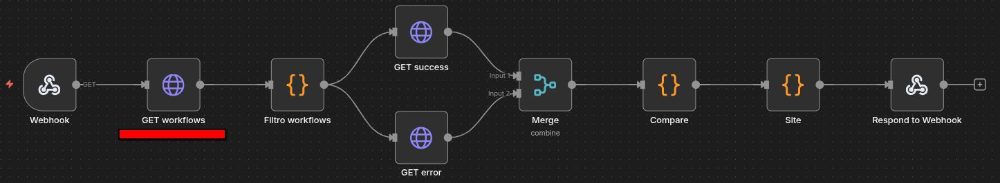
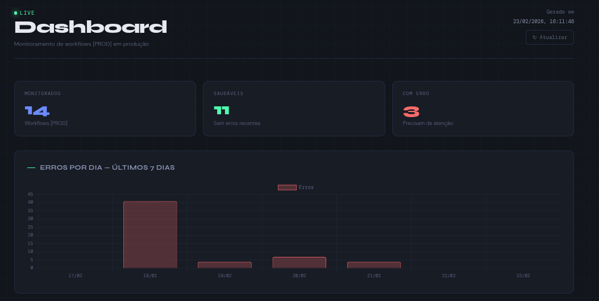
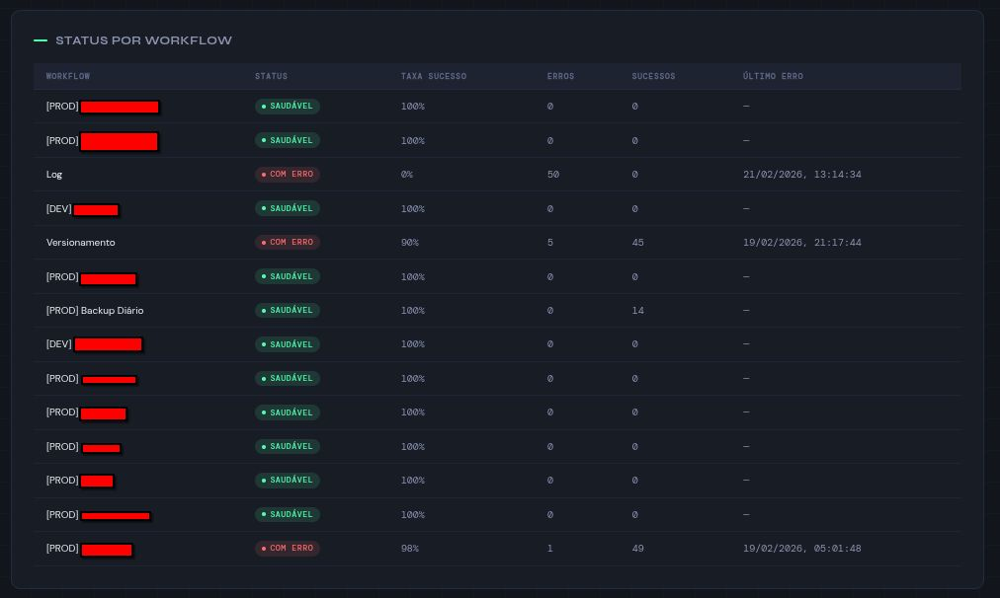

# Dashboard

Painel de monitoramento em tempo real para workflows n8n em produção.

Originado de um problema real: um cliente ligou perguntando por que o WhatsApp não notificava mais seus clientes. A instância havia caído horas antes e só ficamos sabendo quando a mensagem chegou.

---

## O Problema

Sem visibilidade sobre o que roda em produção, falhas só são descobertas quando o cliente reclama.

A solução imediata foi um alerta via Telegram para quedas de instância. Mas isso resolvia só um workflow.

**E os outros?**

---

## A Solução

Dashboard que monitora todos os workflows marcados como `[PROD]` em tempo real, consumindo diretamente a API do n8n — sem dependência de ferramentas externas.

O painel se atualiza automaticamente a cada 30 segundos. Pode ser deixado aberto em um monitor separado durante o trabalho.

---

## Métricas Exibidas

- Total de workflows monitorados
- Workflows saudáveis vs com erro
- Taxa de sucesso por workflow
- Histórico de erros dos últimos 7 dias
- Timestamp do último erro de cada workflow

---

## Workflow

## Dashboard

Acessado via browser pela URL do webhook. Cada acesso consulta a API do n8n em tempo real e retorna o dashboard atualizado.

---

## Stack

- **Orquestração:** n8n
- **Fonte de dados:** API n8n
- **Visualização:** Chart.js
- **Lógica:** Code Node (JavaScript)

---

## 👤 Autor

**Lucas Hideki**  
Product Owner | Automação | n8n | Processos  

📧 lucashidekitb@gmail.com  
🔗 https://www.linkedin.com/in/lucas-hideki-tb