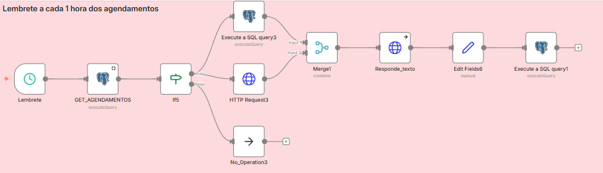

# Lembrete Automático de Agendamentos

## Contexto

Em operações com agendamento, é comum enfrentar:

- Esquecimento por parte do cliente  
- Aumento de faltas (no-show)  
- Perda de receita  
- Tempo desperdiçado na agenda  

Além do esforço manual para envio de lembretes.

---

## Solução

Workflow desenvolvido no **n8n** para envio automático de lembretes de agendamento via WhatsApp.

A automação identifica eventos próximos e dispara mensagens personalizadas dentro de uma janela estratégica.

---

## Funcionalidades

Execução programada (Schedule Trigger)  
Consulta de agendamentos próximos (PostgreSQL)  
Validação de eventos elegíveis  
Geração de mensagem personalizada  
Envio automatizado via API de mensageria  
Atualização de status (`reminder_sent`)  

---

## Regras Implementadas

- Seleciona apenas eventos dentro da janela de tempo definida  
- Ignora agendamentos já notificados  
- Evita lembretes duplicados  
- Mantém controle de estado no banco  

---

## Arquitetura do Workflow

Schedule Trigger  
→ Consulta de eventos (PostgreSQL)  
→ Filtro de elegibilidade  
→ Enriquecimento de dados (cliente / profissional / empresa)  
→ Geração da mensagem  
→ Envio via API  
→ Atualização do evento  

---

## Stack

- n8n  
- PostgreSQL  
- APIs HTTP  
- WhatsApp (via API)  

---

## Workflow

---

## Impacto

Redução de no-show  
Melhoria da experiência do cliente  
Processo totalmente automatizado  
Eliminação de envios manuais  
Comunicação padronizada  

---

## 👤 Autor

**Lucas Hideki**  
Product Owner | Automação | n8n | Processos  

📧 lucashidekitb@gmail.com  
🔗 https://www.linkedin.com/in/lucas-hideki-tb
