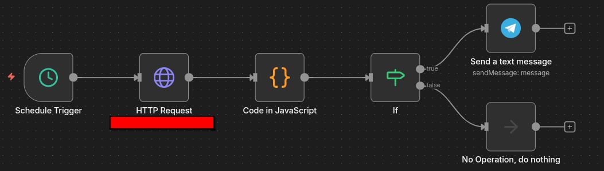

# Monitoramento de Instância WhatsApp

## Contexto

Em operações que dependem do WhatsApp como canal principal, a queda da instância passa despercebida até que um cliente reclame.

O problema identificado em produção:
- Falhas de envio sem causa aparente
- Instância offline sem nenhuma visibilidade
- Time sendo avisado pelo cliente, não pelo sistema
- Ausência de alertas operacionais

---

## Origem

Este workflow nasceu de um problema real em produção.

Monitorando o workflow de lembretes de agendamento, identifiquei falhas nos envios. Ao investigar a causa raiz, a instância WhatsApp do cliente estava offline. O cliente foi avisado imediatamente — mas ficou clara a necessidade de um mecanismo permanente de monitoramento.

Em 40 minutos o workflow estava implementado e ativo.

---

## Solução

Workflow desenvolvido no **n8n** para monitoramento contínuo do estado da instância WhatsApp, com alerta automático via Telegram.

A automação verifica periodicamente a conexão e notifica os responsáveis imediatamente em caso de queda.

---

## Funcionalidades

Execução programada a cada 5 minutos (Schedule Trigger)  
Consulta do estado da instância via API REST  
Avaliação do status de conexão  
Disparo de alerta no Telegram em caso de queda  
Notificação direta no grupo dos sócios  

---

## Lógica Implementada

- Verifica se o estado da instância é `close`
- Se sim, dispara alerta com instância, status e horário
- Se não, o fluxo encerra sem ação
- Sem estado desnecessário — simples de propósito

---

## Arquitetura do Workflow

```
Schedule Trigger
→ Consulta de estado da instância (API REST)
→ Avaliação do status
→ Alerta via Telegram (somente em caso de queda)
```

---

## Stack

- n8n
- JavaScript
- API REST (Evolution API)
- Telegram

---

## Workflow



---

## Impacto

Downtime identificado antes do cliente reclamar  
Alerta imediato para os responsáveis  
Processo de monitoramento automatizado  
Visibilidade operacional em tempo real  
Resposta rápida a falhas de conexão  

---

## 👤 Autor

**Lucas Hideki**  
Product Owner | Automação | n8n | Processos  
📧 lucashidekitb@gmail.com  
🔗 https://www.linkedin.com/in/lucas-hideki-tb
