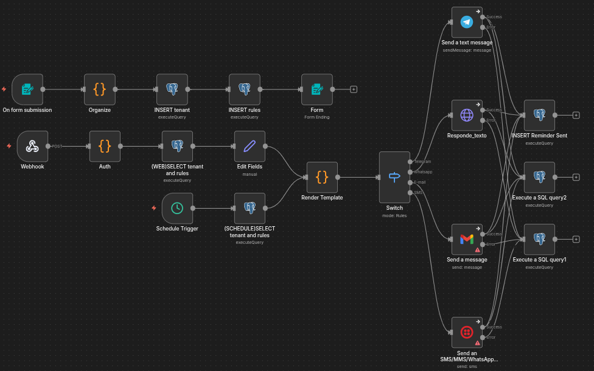
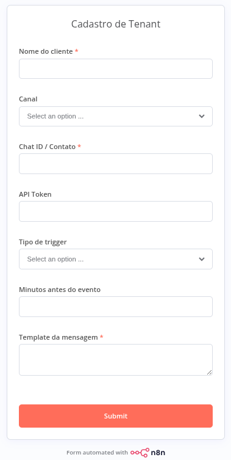

# Multi-Tenant Automation Engine

Sistema de automação centralizado que atende múltiplos clientes a partir de um único workflow. Cada tenant tem sua própria configuração de canal, template de mensagem e regras de disparo, tudo definido no banco de dados, sem duplicar workflows.

---

## O Problema

Tinha um workflow de lembretes rodando em produção para uma barbearia.  
Funcionava bem. Mas a mensagem estava hardcoded no node de envio.  
A janela de tempo era fixa. As credenciais eram específicas daquele cliente.

Se chegasse um segundo cliente com uma dinâmica diferente: duplica tudo.  
Uma clínica com tom mais formal: mais um workflow.  
Um restaurante que quer confirmação de pedido: outro workflow.

Um workflow por cliente. Isso não escala.

---

## A Solução

Um único workflow central que lê a configuração do tenant e decide sozinho quando disparar, o que enviar e por qual canal.

Adicionar um novo cliente é só preencher um formulário.

---

## O que o sistema suporta

- **Clínica A**: lembrete formal, 2h antes, Telegram
- **Clínica B**: lembrete descontraído, 1 dia antes + 2h antes, Telegram
- **Restaurante C**: confirmação de pedido via webhook, Telegram

O mesmo workflow. Configurações completamente diferentes. Zero duplicação.

---

## Triggers

**Schedule** — roda a cada 5 minutos e busca eventos dentro da janela de tempo correta para cada regra de cada tenant.

**Webhook** — aceita eventos externos autenticados por token no header. Qualquer sistema pode disparar uma automação com a requisição correta.

**Form Trigger** — interface de cadastro nativa do n8n. Novo tenant entra pelo formulário sem tocar no banco. O cadastro também pode vir de qualquer sistema externo via requisição.

---

## Decisão Técnica

O coração do sistema é uma query que calcula dinamicamente a janela de tempo correta para cada regra de cada tenant:

```sql
AND e.event_datetime 
  BETWEEN NOW() + (r.timing_minutes_before * INTERVAL '1 minute')
      AND NOW() + (r.timing_minutes_before * INTERVAL '1 minute') 
        + INTERVAL '5 minutes'
AND NOT EXISTS (
  SELECT 1 FROM tenant_reminders_sent rs
  WHERE rs.rule_id = r.id AND rs.event_id = e.id
)
```

O `NOT EXISTS` garante idempotência, mesmo que o workflow rode múltiplas vezes, cada cliente recebe o lembrete uma única vez.

O template é renderizado em JavaScript com variáveis dinâmicas por tenant:

```javascript
let message = item.message_template;
for (const [key, value] of Object.entries(variables)) {
  message = message.replaceAll(`{{${key}}}`, value);
}
```

---

## Multicanal

O Switch node roteia para o canal configurado de cada tenant.

Atualmente ativo: **Telegram**  
Nodes estruturados e prontos para ativar: WhatsApp (Evolution API) · E-mail (Gmail) · SMS (Twilio)

---

## Workflow



---

## Telegram


---

## Formulário



---

## Stack

- **Orquestração:** n8n
- **Banco de dados:** PostgreSQL
- **Canais:** Telegram · WhatsApp · Gmail · Twilio
- **Lógica:** Code Node (JavaScript)

---

## 👤 Autor

**Lucas Hideki**  
Product Owner | Automação | n8n | Processos  

📧 lucashidekitb@gmail.com  
🔗 https://www.linkedin.com/in/lucas-hideki-tb