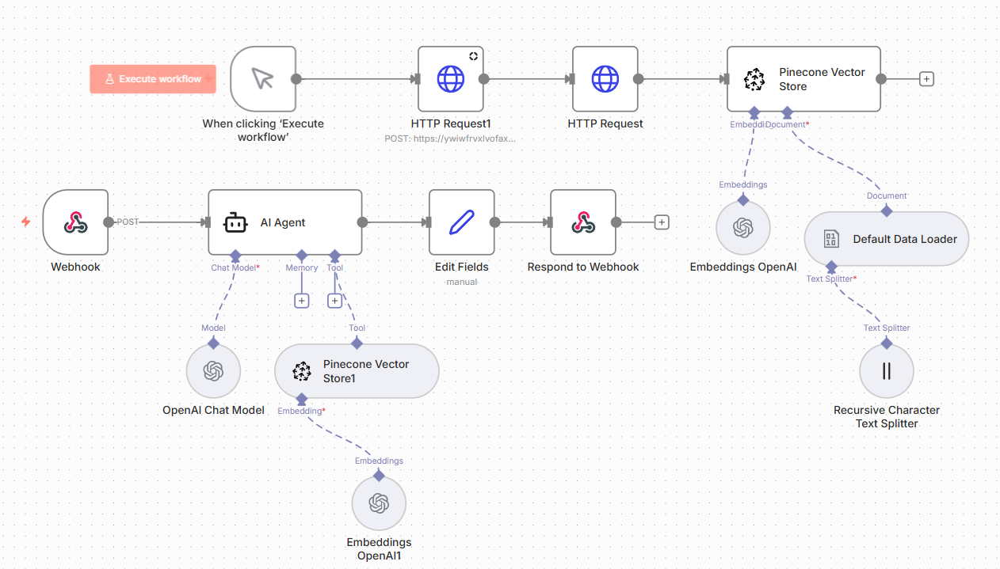

# RAG AI Agent – Consulta de Documentos

## Contexto

Necessidade de permitir consultas inteligentes sobre documentos, evitando respostas genéricas de IA e garantindo precisão baseada em conteúdo real.

---

## Solução

Workflow desenvolvido no **n8n** implementando arquitetura de **RAG (Retrieval-Augmented Generation)**.

A solução combina embeddings, banco vetorial e AI Agent para responder perguntas com base em documentos indexados.

---

## Funcionalidades

Ingestão de documentos  
Splitter para segmentação de texto  
Geração de embeddings (OpenAI)  
Armazenamento vetorial (Pinecone)  
Retrieval como tool  
AI Agent orientado por contexto  
Restrições de escopo via system prompt  

---

## Inteligência Implementada

- Busca semântica em vector store  
- Respostas baseadas exclusivamente nos documentos  
- Prevenção de alucinação fora da base  
- Controle de comportamento do agente  

---

## Stack

- n8n  
- OpenAI (Embeddings + Chat Model)  
- Pinecone (Vector Database)  

---

## Workflow

---

## Impacto

Respostas contextualizadas  
IA baseada em conhecimento estruturado  
Redução de respostas imprecisas  
Arquitetura escalável  

---

## 👤 Autor

**Lucas Hideki**  
Product Owner | Automação | n8n | Processos  

📧 lucashidekitb@gmail.com  
🔗 https://www.linkedin.com/in/lucas-hideki-tb

