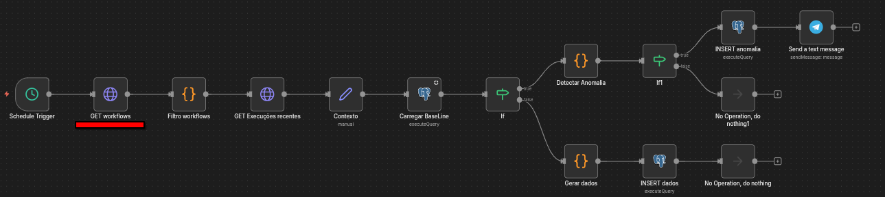
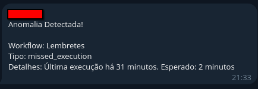
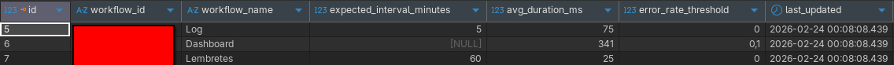
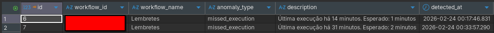

# Self-Healing Workflow

Sistema de monitoramento inteligente que aprende o comportamento normal de cada workflow em produção e detecta anomalias automaticamente antes que virem problemas.

---

## O Problema

O Resiliency Dashboard mostra o que quebrou.  
Mas você ainda descobre depois que já aconteceu.

A pergunta que ficou: dá para detectar antes?

---

## A Solução

Na primeira execução o sistema não monitora — ele aprende. Calcula o tempo médio de execução, a taxa de erro aceitável e o intervalo esperado entre execuções. Esse é o baseline.

A partir daí, a cada 5 minutos compara o comportamento atual com o baseline e detecta anomalias automaticamente.

---

## Tipos de Anomalia Detectados

- **high_error_rate** — taxa de erro acima do threshold histórico
- **slow_execution** — execução demorando mais que o dobro do tempo médio
- **missed_execution** — workflow que deveria ter rodado mas não rodou

Quando detecta, salva no banco e dispara alerta no Telegram.

---

## Decisão Técnica

O maior desafio foi o erro "Multiple matches" — quando o n8n não consegue parear itens de nodes diferentes em loops com múltiplos workflows.

A solução foi um LEFT JOIN no próprio SELECT do Postgres, trazendo os dados do baseline junto com o contexto do workflow em uma única query. Zero referência a nodes anteriores, zero ambiguidade.

---

## Workflow

---

## Telegram

---

## Banco de dados

---

## Stack

- **Orquestração:** n8n
- **Banco de dados:** PostgreSQL
- **Alertas:** Telegram Bot API
- **Lógica:** Code Node (JavaScript)

---

## 👤 Autor

**Lucas Hideki**  
Product Owner | Automação | n8n | Processos  

📧 lucashidekitb@gmail.com  
🔗 https://www.linkedin.com/in/lucas-hideki-tb