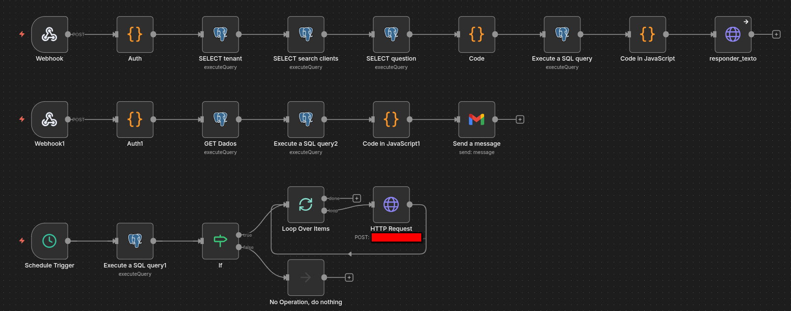
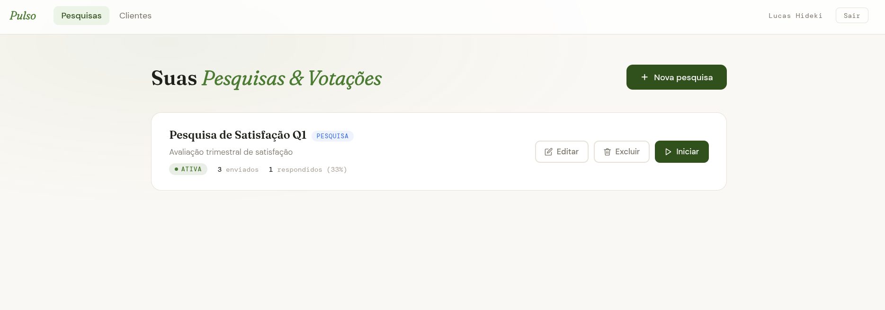
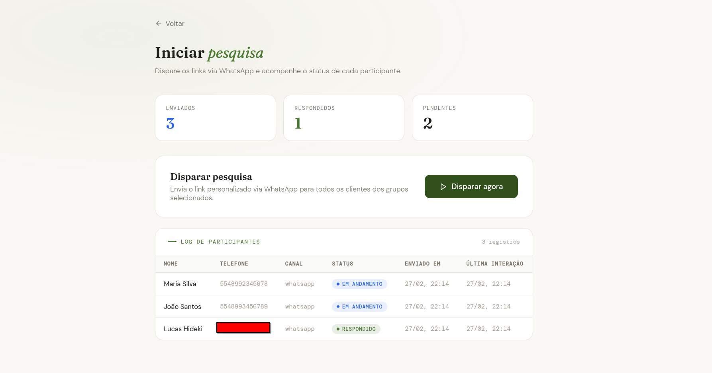
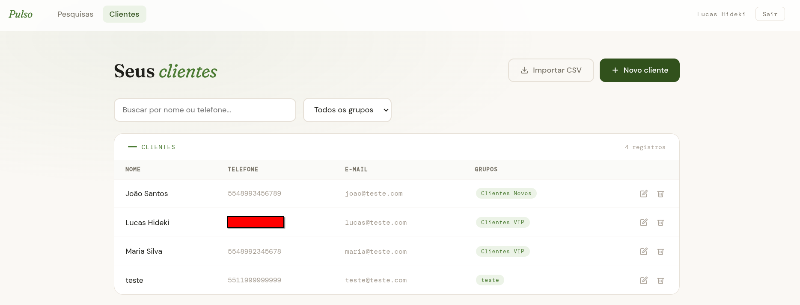
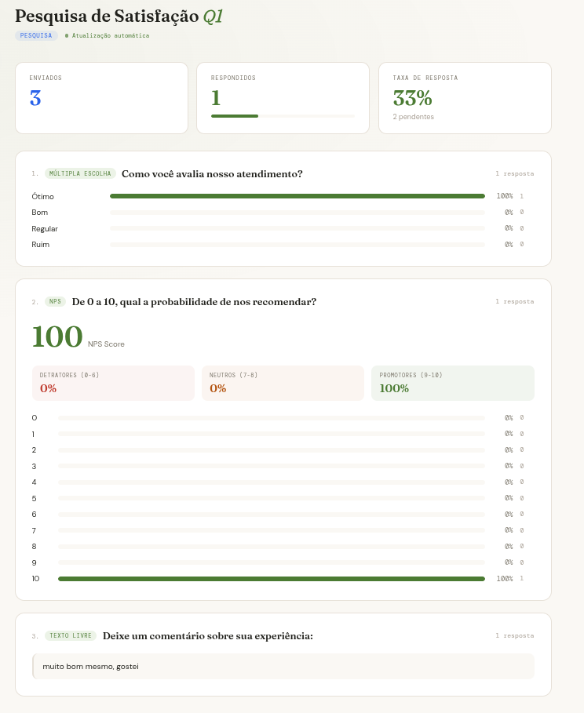

# Pulso

Plataforma de pesquisas e votações disparadas via WhatsApp. Cada tenant tem sua própria base de clientes, grupos e configurações. O n8n orquestra o disparo e os relatórios. O Flask entrega o produto.

---

## Proposito

Um sistema centralizado onde o tenant cria a pesquisa ou votação, define as perguntas e os grupos de destinatários, e com um clique dispara os links personalizados via WhatsApp para cada participante.

Cada participante recebe um link único. Responde pelo celular. O resultado aparece em tempo real no painel do gestor.

Adicionar uma nova pesquisa é preencher um formulário. Adicionar um novo cliente é importar um CSV.

---

## O que o sistema suporta

- **Empresa A**: pesquisa de satisfação com NPS, múltipla escolha e texto livre, disparada para grupo de clientes VIP
- **Empresa B**: votação interna para escolha de benefícios, com resultado em tempo real
- **Empresa C**: pesquisa pós-atendimento com encerramento automático por data

O mesmo sistema. Configurações completamente diferentes. Zero duplicação.

---

## Triggers

**Disparo manual** — o gestor clica em "Iniciar" no painel. O n8n recebe o webhook, cria os participantes no banco com UUID único e dispara o link personalizado via WhatsApp para cada contato do grupo selecionado.

**Encerramento manual** — o gestor clica em "Encerrar". O Flask atualiza o status para `closed` e aciona o webhook de relatório no n8n.

**Schedule diário** — roda todo dia e busca pesquisas com `expires_at <= NOW()` e `report_sent_at IS NULL`. Para cada uma encontrada, aciona o workflow de relatório automaticamente.

---

## Decisão Técnica

O controle de idempotência no relatório garante que encerramento manual e Schedule nunca concorram e disparem dois e-mails para o mesmo destinatário:

```sql
WHERE s.expires_at <= NOW()
  AND s.status != 'closed'
  AND s.report_sent_at IS NULL
```

Após o envio, o workflow atualiza `report_sent_at = NOW()` — qualquer execução seguinte ignora essa pesquisa.

O token UUID por participante é gerado direto no PostgreSQL:

```sql
INSERT INTO survey_participants (survey_id, client_id, channel, token)
VALUES (..., gen_random_uuid())
```

Isso garante um voto ou resposta por pessoa sem autenticação complexa no front. O link é o token. O token é a identidade.

O Schedule não duplica lógica — ele chama o próprio webhook de relatório passando o `survey_id` e o `api_token` do tenant:

```
Schedule → busca vencidas → HTTP Request → /webhook/survey-report
```

Um workflow aciona o outro. Zero duplicação de código.

---

## Separação de Responsabilidades

O n8n brilha em orquestração — conectar sistemas, reagir a eventos, disparar fluxos. CRUD, sessão e lógica de produto são mais limpos em código.

**n8n cuida de:**
- Autenticação multi-tenant via token no header
- Criação dos participantes no Supabase
- Disparo do link via WhatsApp (Evolution API)
- Geração do relatório em HTML
- Envio por e-mail (Gmail)
- Schedule de encerramento automático

**Flask cuida de:**
- API REST completa
- Painel do gestor (pesquisas, clientes, dashboard)
- Front do participante
- Lógica de sessão e autenticação

---

## Relatório Automático

Quando uma pesquisa encerra — manualmente ou por data — o n8n gera um relatório em HTML e envia por e-mail com:

- Taxa de resposta (enviados vs respondidos)
- NPS Score com detratores, neutros e promotores
- Distribuição por opção em barras de progresso
- Respostas de texto livre listadas


---

## Workflow



---

## Sistema






---

## Stack

- **Orquestração:** n8n self-hosted
- **Backend:** Python · Flask
- **Banco de dados:** Supabase (PostgreSQL)
- **WhatsApp:** Evolution API
- **E-mail:** Gmail via n8n
- **Front:** HTML · CSS · JavaScript

---

## Autor

**Lucas Hideki Tobaro Barbeiro**  
Engenheiro de Automação & IA | n8n | Python | LLMs  
📧 lucashidekitb@gmail.com  
🔗 https://www.linkedin.com/in/lucas-hideki-tb