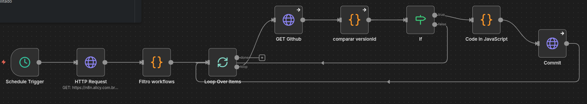

# Versionamento Automático de Workflows – n8n + GitHub

## Contexto

Ao evoluir workflows no n8n, surge um problema comum em ambientes reais:

Dificuldade em visualizar o que mudou  
Ausência de diff nativo confiável  
Versionamento manual pouco eficiente  
Backups não garantem rastreabilidade clara  

Isso gera risco operacional, especialmente em automações críticas.

---

## Solução

Workflow desenvolvido no **n8n** para **versionamento automático de workflows**.

A automação consulta periodicamente a API do n8n, identifica alterações via `versionId` e realiza commit automático no GitHub.

O resultado é um histórico auditável e rastreável das mudanças.

---

## Funcionalidades

Consulta periódica dos workflows (Schedule Trigger)  
Integração com API n8n  
Filtro de workflows por tag  
Processamento individual (Loop Over Items)  
Comparação baseada em `versionId`  
Detecção de mudanças reais  
Commit automático no GitHub  
Criação de arquivos versionados (.json)  

---

## Inteligência Implementada

- Comparação de versões sem diff manual  
- Detecção de alterações reais (`versionId`)  
- Evita commits desnecessários  
- Tratamento de workflows novos (404 → create)  
- Versionamento transparente e automático  

---

## Stack

- n8n  
- API n8n  
- GitHub API  
- JavaScript (Code Node)  

---

## Workflow

---

## Impacto

Rastreabilidade de mudanças  
Histórico de versões confiável  
Maior segurança em produção  
Governança de workflows  
Redução de erros operacionais  

---

## 👤 Autor

**Lucas Hideki**  
Product Owner | Automação | n8n | Processos  

📧 lucashidekitb@gmail.com  
🔗 https://www.linkedin.com/in/lucas-hideki-tb